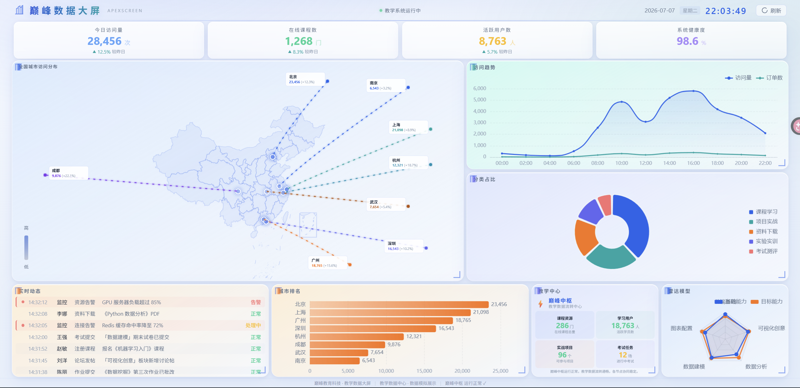

<div align="center">

# 🏆 巅峰数据大屏 · ApexScreen


**一个面向教学数据场景的现代化数据可视化大屏 · A modern data visualization dashboard for education**

[English](#english) · [中文](#中文)

</div>

---

## 中文

### 📖 项目简介

**巅峰数据大屏（ApexScreen）** 是一个面向**教学数据中心**场景的数据可视化大屏项目。采用 **Vue 3 + TypeScript + ECharts 6** 技术栈，提供 16:9 固定视口布局的课堂教学演示工具。

### 🖼️ 界面预览

| 完整大屏 |
|:---:|
|  |

### ✨ 核心特性

| 特性 | 说明 |
|------|------|
| 🗺️ **2.5D 中国地图** | 基于 ECharts Map + 真实 GeoJSON，显示 8 城市访问量分布，带城市引出线和流动光效 |
| 🏫 **教学数据流转中心** | 巅峰中枢 + 课程/用户/项目/考试四类节点，卡片网格展示 |
| 📈 **访问趋势** | 24h 双轴折线图（访问量 + 订单数），渐变面积效果 |
| 🍩 **分类占比** | 环形图展示课程学习、项目实战等五类占比 |
| 🏙 **城市排名** | 横向柱状图，渐变颜色 + 同比增长提示 |
| 📡 **雷达模型** | 多维度能力评估，支持当前/目标双系列对比 |
| 📋 **实时动态** | 20 条日志循环自动滚动，告警条目红条高亮 |
| 🎨 **浅色毛玻璃主题** | `backdrop-filter: blur` 毛玻璃卡片 + 渐变光带 + 四角装饰 |
| ✨ **过渡动画** | 页面入场淡入、KPI 交错出现、加载遮罩平滑过渡 |

### 🚀 快速开始

```bash
# 前置条件：Node.js >= 18
pnpm create vite apex-screen --template vue-ts  # 或直接使用已有项目

# 安装依赖
npm install

# 启动开发服务器
npm run dev

# 打开浏览器访问
open http://localhost:3000
```

### 📸 生成截图

```bash
# 确保开发服务器在运行
npm run dev

# 截图（默认 http://localhost:3000）
npm run screenshot

# 自定义地址
URL=http://localhost:5173 npm run screenshot
```

截图输出在 `docs/screenshots/dashboard-1920x1080.png`。

### 🧪 测试

```bash
# 单元测试（Vitest）
npm run test

# E2E 测试（Playwright）
npx playwright test

# 类型检查
npm run type-check
```

### 🏗️ 项目结构

```
ApexScreen/
├── src/
│   ├── config/                    # 环境变量 + 应用配置
│   │   ├── env.ts                 # VITE_ 环境变量读取
│   │   └── app.config.ts          # 业务配置
│   ├── styles/
│   │   └── global.css             # 浅色毛玻璃主题全局样式
│   ├── logging/
│   │   └── logger.ts              # 日志系统（Level / Transport）
│   ├── data/
│   │   ├── adapters/              # 数据适配器（Mock / Api）
│   │   └── mock/
│   │       └── dashboard.ts       # Mock 数据（写死，课堂演示用）
│   ├── features/
│   │   └── dashboard/
│   │       ├── components/        # 大屏组件
│   │       │   ├── charts/        #   ECharts 图表（4 个）
│   │       │   ├── MetricCard.vue #   KPI 指标卡
│   │       │   ├── RealtimeLog.vue#   实时动态列表
│   │       │   ├── CampusMap.vue  #   教学数据流转中心
│   │       │   └── ChinaMap.vue   #   2.5D 中国地图
│   │       ├── composables/       # Vue 组合式函数
│   │       ├── stores/            # Pinia 状态管理
│   │       ├── services/          # API 数据服务
│   │       └── types.ts           # TypeScript 类型定义
│   └── views/
│       └── DashboardView.vue      # 主页面（16:9 网格布局）
├── e2e/                           # Playwright E2E 测试
├── scripts/
│   └── capture-dashboard.mjs      # 自动化截图脚本
├── docs/
│   └── screenshots/               # 截图输出目录
├── public/
│   └── geo/china.json             # 中国地图 GeoJSON
├── .env / .env.development        # 环境变量
├── vite.config.ts                 # Vite 配置
├── tsconfig.json                  # TypeScript 配置
├── eslint.config.js               # ESLint 10 扁平化配置
├── stylelint.config.js            # Stylelint 配置
└── playwright.config.ts           # Playwright 配置
```

### 🛠️ 技术栈

| 类别 | 技术 |
|------|------|
| **框架** | Vue 3 (Composition API + `<script setup>`) |
| **语言** | TypeScript 6 |
| **构建** | Vite 8 |
| **状态管理** | Pinia |
| **路由** | Vue Router 4 (Hash History) |
| **图表** | ECharts 6 (Tree-shaking: Line/Bar/Pie/Radar/Scatter/Map) |
| **测试** | Vitest + Vue Test Utils / Playwright |
| **代码质量** | ESLint 10 + Prettier + Stylelint + Husky + lint-staged |
| **提交规范** | Commitlint (Conventional Commits) |

### 🌈 设计风格

参考自 [shadcn/dv](https://ui.shadcn.com/) 设计语言，整体采用**浅色毛玻璃**风格：

- **背景**：径向蓝青光晕 + 线性浅蓝渐变
- **卡片**：`backdrop-filter: blur(14px)` 毛玻璃效果
- **配色**：每面板分配蓝/青/橙/紫不同变体，顶部有渐变光带
- **细节**：四角装饰线、渐变发光标题、紧凑字体排版

### 📄 开源协议

本项目采用 [MIT 许可证](LICENSE)。

---

## English

### 📖 Introduction

**ApexScreen** (巅峰数据大屏) is a data visualization dashboard built for **teaching data center** scenarios. It uses **Vue 3 + TypeScript + ECharts 6** to deliver a fixed 16:9 viewport layout ideal for classroom demonstrations.

### 🖼️ Screenshots

| Full Dashboard |
|:---:|
|  |

### ✨ Features

| Feature | Description |
|---------|------------|
| 🗺️ **2.5D China Map** | ECharts Map with GeoJSON, 8 city markers with animated flow lines |
| 🏫 **Campus Data Hub** | Central hub + 4 business nodes in card grid |
| 📈 **Access Trend** | Dual-axis line chart (24h window), gradient area |
| 🍩 **Category Share** | Donut chart for 5 learning categories |
| 🏙 **City Ranking** | Horizontal bar chart with gradient colors |
| 📡 **Radar Model** | Multi-dimension capability assessment |
| 📋 **Realtime Logs** | 20 auto-cycling log entries with alert highlighting |
| 🎨 **Frosted Glass Theme** | `backdrop-filter: blur` panels with gradient bands |
| ✨ **Transitions** | Page enter fade, KPI stagger, loading overlay |

### 🚀 Quick Start

```bash
# Prerequisites: Node.js >= 18
npm install
npm run dev
open http://localhost:3000
```

### 📸 Generate Screenshots

```bash
npm run dev
node scripts/capture-dashboard.mjs
```

### 🧪 Testing

```bash
npm run test          # unit tests (Vitest)
npx playwright test   # E2E tests
npm run type-check    # TypeScript check
```

### 🛠️ Tech Stack

- **Framework**: Vue 3 (Composition API + `<script setup>`)
- **Language**: TypeScript 6
- **Build**: Vite 8
- **State**: Pinia
- **Routing**: Vue Router 4 (Hash)
- **Charts**: ECharts 6 (Tree-shaken)
- **Testing**: Vitest + Vue Test Utils / Playwright
- **Quality**: ESLint 10 + Prettier + Stylelint + Husky

### 📄 License

[MIT](LICENSE)

---

<div align="center">

**Made with ❤️ by [Chenxu Wang](https://github.com/wchenxu596-tech)**

</div>
